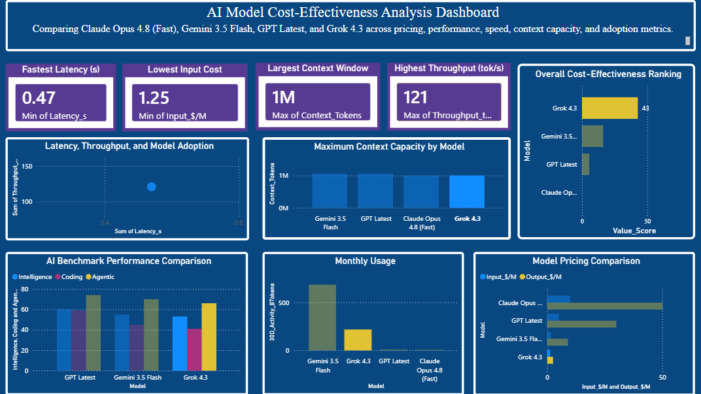
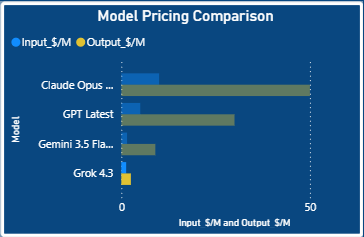
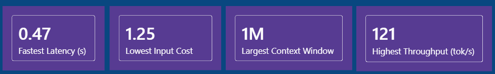
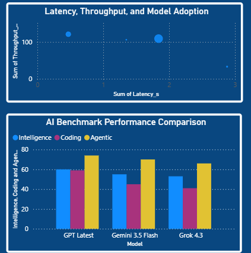

# AI Model Cost-Effectiveness Dashboard

Power BI dashboard comparing leading AI models across pricing, benchmark performance, latency, throughput, context window, and adoption metrics.

## Dashboard Overview

## Project Objective

Evaluate which AI model delivers the best balance of performance and cost using publicly available OpenRouter comparison data.

## Models Analyzed

- Claude Opus 4.8 (Fast)
- Gemini 3.5 Flash
- GPT Latest
- Grok 4.3

## Key Metrics

- Input Cost ($/M Tokens)
- Output Cost ($/M Tokens)
- Latency
- Throughput
- Context Window
- Intelligence Score
- Coding Score
- Agentic Score
- Monthly Usage

## Pricing Analysis

## Benchmark Comparison

## Key Findings

- Grok 4.3 achieved the highest cost-effectiveness score.
- GPT Latest achieved the strongest benchmark performance.
- Gemini 3.5 Flash provided a strong balance between performance and cost.
- Claude Opus 4.8 (Fast) delivered premium performance at the highest operational cost.

## Tools Used

- Power BI
- Excel
- DAX
- OpenRouter Model Comparison Data

## Files

- AI_Model_Cost_Effectiveness_Dashboard.pbix
- data/AI_Model_Cost_Effectiveness.xlsx
